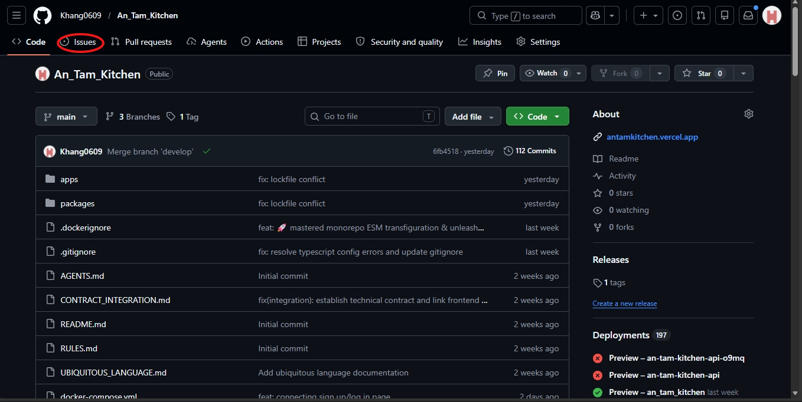
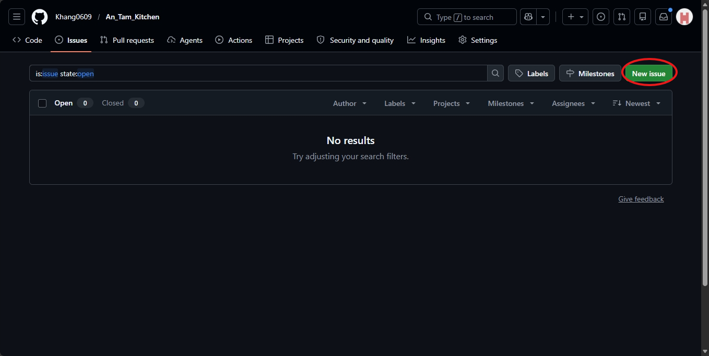
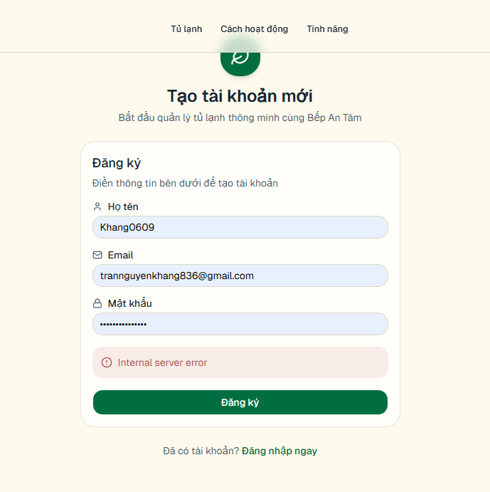
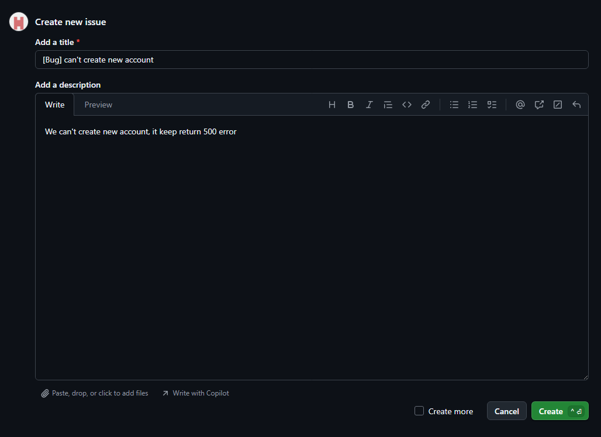
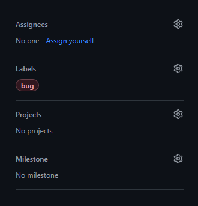
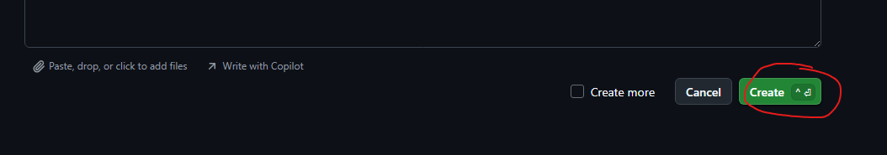

# 🐞 Manual Testing: How to Report a Bug (Create Issue)

Follow these steps to report any bugs you find while testing the website. A good bug report helps Developers fix the problem faster!

---

### Step 1: Navigate to the "Issues" Tab
From the main page of the repository, look at the top menu bar and click on the **Issues** tab.

> 

---

### Step 2: Create a New Issue
Click the green **New issue** button located on the right side of the screen.

> 

---

### Step 3: Fill in the Issue Title
A good title should be concise and descriptive. Use the format: `[Bug] Short description of the problem`.

*   **Bad:** "It doesn't work"
*   **Good:** `[Bug] Login button remains disabled after entering valid credentials`

---

### Step 4: Write the Description (The Most Important Part)
Use the following template for your bug report. This ensures developers have all the information they need to fix the issue.

**Bug Report Template:**
```markdown
**Severity:** [S1 – Blocker | S2 – Critical | S3 – Medium | S4 – Minor]
**Priority:** [P1 – Fix immediately | P2 – Fix before release | P3 – Fix when possible]

**Environment:**
- URL:            <link to the page>
- Browser:        [Chrome 121 | Edge 120 | Chrome Android 120]
- Screen size:    [375×812 | 1366×768 | ...]
- Device:         [Samsung A54 (Real) | iPhone SE Emulator]

**Description**:
<Short description of the problem: button overflow, text cut off, etc.>

**Steps to Reproduce:**
1. Go to page '...'
2. At screen size '...'
3. Observe element '...'

**Actual Result:**
<Describe the bug, attach marked screenshot>

**Expected Result:**
<Describe the interface as per design or logical behavior>

**Screenshots / Videos:**
<Attach files>

**Additional Notes:**
(WCAG related, specific responsive breakpoint, etc.)
```

**Pro Tip:** Drag and drop **Screenshots** or **Screen Recordings** directly into this text box to make it visual!



---

### Step 5: Assign Labels and Assignees (Sidebar)
On the right sidebar:
*   **Assignees:** Select the Developer in charge (e.g., Khang).
*   **Labels:** Click the gear icon and select **bug**.

> 

---

### Step 6: Submit New Issue
Review your information one last time, then click the green **Submit new issue** button at the bottom.

> 

---

### ✅ Success!
The issue is now live. The Developer will receive a notification and can start fixing it immediately. You can track the progress right inside this Issue.